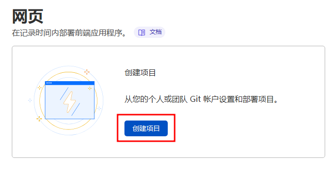
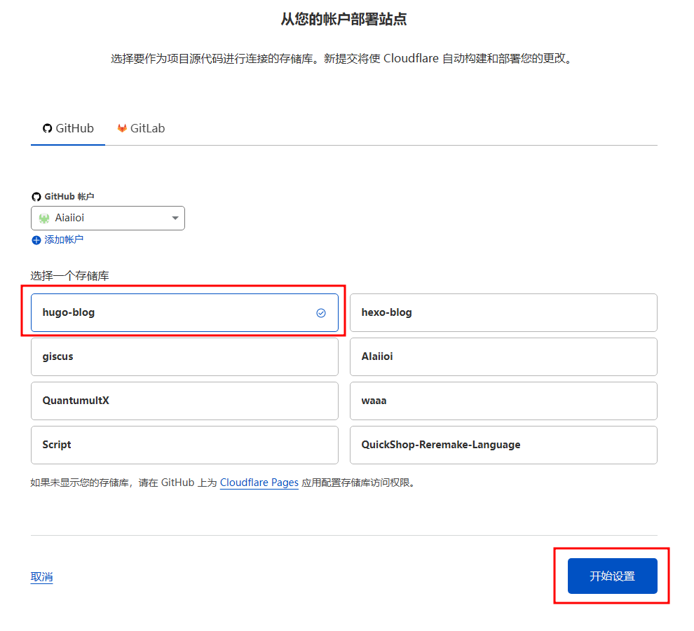
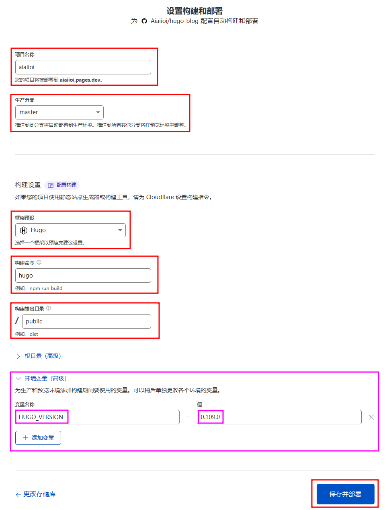
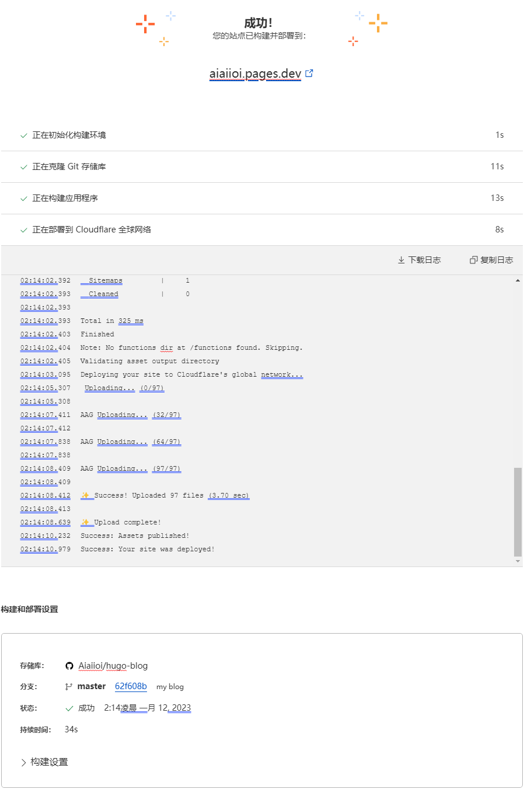

---
########## 文章标题
title: "使用 Cloudflare Pages 免费部署 HUGO 博客"
########## 文章副标题
subtitle: ""
########## 页面图片, 用于 Open Graph 和 Twitter Cards
images: []
########## 用在主页预览的文章特色图片
featuredImagePreview: ""
################# 特色照片
featuredImage: "../cloudflare-pages-hugo/img/logo.webp"
########## 标签
tags: [Hugo,博客,Cloudflare Pages,Cloudflare]
########## 分类
categories: [挖站]

# 这篇文章创建的日期时间. 它通常是从文章的前置参数中的 date 字段获取的, 但是也可以在 网站配置 中设置
date: 2023-01-12T05:18:52+08:00
# 上次修改内容的日期时间
lastmod: 2023-01-12T05:18:52+08:00
# 如果设为 true, 除非 hugo 命令使用了 --buildDrafts/-D 参数, 这篇文章不会被渲染
draft: false
# 文章作者
author: ""
# 文章作者的链接
authorLink: ""
# 文章内容的描述
description: ""
# 这篇文章特殊的许可
license: ""
# 是否在主页隐藏一篇文章
hiddenFromHomePage: false
# 是否在搜索结果中隐藏一篇文章
hiddenFromSearch: false
# 是否使用 twemoji
twemoji: false
# 是否使用 lightgallery
lightgallery: true
# 是否使用 ruby 扩展语法
ruby: true
# 是否使用 fraction 扩展语法
fraction: true
# 是否使用 fontawesome 扩展语法
fontawesome: true
# 是否在文章页面显示原始 Markdown 文档链接
linkToMarkdown: true
# 是否在 RSS 中显示全文内容
rssFullText: false

toc:
  enable: true
  auto: true
code:
  copy: true
  maxShownLines: 50
math:
  enable: false
  # ...
mapbox:
  # ...
share:
  enable: true
  # ...
comment:
  enable: true
  # ...
library:
  css:
    # someCSS = "some.css"
    # located in "assets/"
    # Or
    # someCSS = "https://cdn.example.com/some.css"
  js:
    # someJS = "some.js"
    # located in "assets/"
    # Or
    # someJS = "https://cdn.example.com/some.js"
seo:
  images: []
  # ...
---
<!--more-->
## 1. 建立HUGO本地站点

本地部署好Hugo站点后，新建一个Github库，公开或私人库都可以。然后将本地Hugo博客pull到Github库里。

## 2. 设置Cloudflare Pages

**2-1.**  登录[https://dash.cloudflare.com/](https://dash.cloudflare.com/)，打开[Cloudflare Pages](https://pages.cloudflare.com/)，点击 **创建项目**



---

**2-2.** 然后链接下Github账户


---

**2-3.** 链接后选择刚才推送Github的库，再点击 **开始设置**



---

**2-4.** 填写相关部署信息

**项目名称** 可以设定一个自己想要的二级域名，*.pages.dev。

**生成分支** 选择库的项目分支。

**框架预设** 选择Hugo预设。

**构建命令** 和 **构建输出目录** 直接按预设就可以。

最后点击 **保存并部署** 。





**如果部署失败，还需要添加一个环境变量。**
| 变量名称         | 值       |
|:------------:|:-------:|
| HUGO_VERSION | 0.109.0 |

截止发布此笔记日期，Cloudflare Pages 的Hugo预设采用了旧版本，需要设置一个Hugo版本的**环境变量**，我填写的是截止此笔记发布日期的最新版本。

版本号要填写全部，比如 0.109.0 不能填写成 0.109。


---

**2-5.**  稍等一下就可以查看部署结果了，如果成功的话就可以直接用刚才设置的二级域名访问博客了，下一步就是开始绑定自己的域名。



以下是我的第一次部署日志：

```toml
02:13:38.081    Cloning repository...
02:13:39.110    From https://github.com/Aiaiioi/hugo-blog
02:13:39.111     * branch            62f608b75a201928268ec3225e2b5ce7fad082cb23e262e -> FETCH_HEAD
02:13:39.111    
02:13:39.173    HEAD is now at 62f608b my blog
02:13:39.174    
02:13:48.464    Submodule 'themes/LoveIt' (https://github.com/dillonzq/LoveIt.git) registered for path 'themes/LoveIt'
02:13:48.464    Cloning into '/opt/buildhome/clone/themes/LoveIt'...
02:13:48.465    Submodule path 'themes/LoveIt': checked out 'e9e89a4613b3aee82359682223b7d246f59321263491'
02:13:48.465    
02:13:48.508    Success: Finished cloning repository files
02:13:49.388    Installing dependencies
02:13:49.406    Python version set to 2.7
02:13:53.498    v12.18.0 is already installed.
02:13:54.836    Now using node v12.18.0 (npm v6.14.4)
02:13:55.110    Started restoring cached build plugins
02:13:55.134    Finished restoring cached build plugins
02:13:55.728    Attempting ruby version 2.7.1, read from environment
02:13:59.974    Using ruby version 2.7.1
02:14:00.387    Using PHP version 5.6
02:14:00.625    5.2 is already installed.
02:14:00.663    Using Swift version 5.2
02:14:00.663    Installing Hugo 0.109.0
02:14:01.799    hugo v0.109.0-47b3312b83e6362242e5e1601813ff3e6790c2191e371+extended linux/amd64 BuildDate=2022-12-23T10:38:11Z VendorInfo=gohugoio
02:14:01.804    Started restoring cached go cache
02:14:01.825    Finished restoring cached go cache
02:14:01.992    go version go1.14.4 linux/amd64
02:14:02.010    go version go1.14.4 linux/amd64
02:14:02.014    Installing missing commands
02:14:02.014    Verify run directory
02:14:02.014    Executing user command: hugo
02:14:02.129    Start building sites … 
02:14:02.130    hugo v0.109.0-47b3312b83e6362242e5e1601813ff3e6790c2191e371+extended linux/amd64 BuildDate=2022-12-23T10:38:11Z VendorInfo=gohugoio
02:14:02.391    
02:14:02.391                       | ZH-CN  
02:14:02.391    -------------------+--------
02:14:02.392      Pages            |    11  
02:14:02.392      Paginator pages  |     0  
02:14:02.392      Non-page files   |     3  
02:14:02.392      Static files     |    73  
02:14:02.392      Processed images |     0  
02:14:02.392      Aliases          |     1  
02:14:02.392      Sitemaps         |     1  
02:14:02.393      Cleaned          |     0  
02:14:02.393    
02:14:02.393    Total in 325 ms
02:14:02.403    Finished
02:14:02.404    Note: No functions dir at /functions found. Skipping.
02:14:02.405    Validating asset output directory
02:14:03.095    Deploying your site to Cloudflare's global network...
02:14:05.307    Uploading... (0/97)
02:14:05.308    
02:14:07.411    AAG Uploading... (32/97)
02:14:07.412    
02:14:07.838    AAG Uploading... (64/97)
02:14:07.838    
02:14:08.409    AAG Uploading... (97/97)
02:14:08.409    
02:14:08.412    ✨ Success! Uploaded 97 files (3.70 sec)
02:14:08.413    
02:14:08.639    ✨ Upload complete!
02:14:10.232    Success: Assets published!
02:14:10.979    Success: Your site was deployed!
```

---

**官方参考资料：**[Deploy a Hugo site · Cloudflare Pages docs](https://developers.cloudflare.com/pages/framework-guides/deploy-a-hugo-site/)


错别字错别字。。- -！！！
